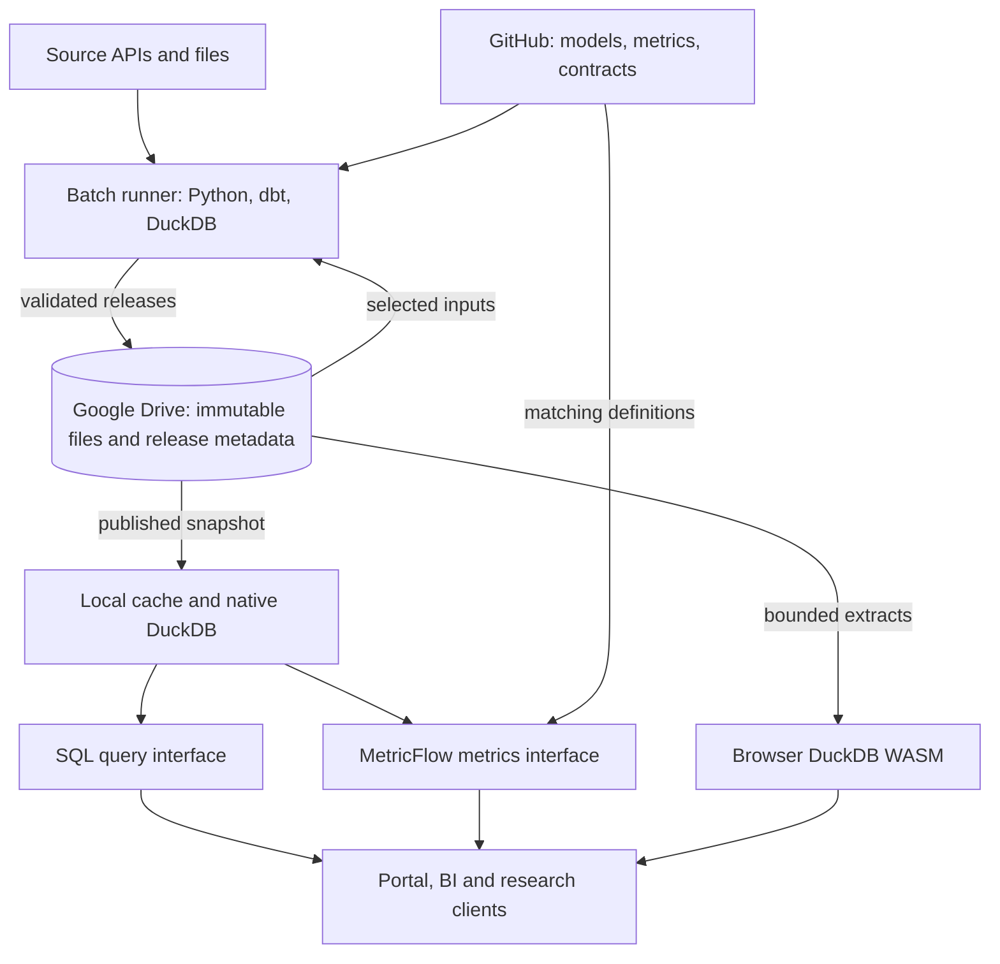

# Zohelo Data architecture proposal

Version 0.1. Prepared 5 September 2026. **Status: Proposed.** Repository inspected: [rutkala/zohelo-data at 2634be2](https://github.com/rutkala/zohelo-data/tree/2634be278f7c5086f6b4251f52aff6bb51a0fd42). This is a design review based on source inspection and current upstream documentation; it is not a benchmark or a deployment validation.

The proposed stack uses Google Drive as the durable data store, Parquet as the published table format, DuckDB as the compute engine, dbt Core as the transformation framework, and self-managed MetricFlow as the metrics engine. The existing React portal provides the catalog and query interface.

In this proposal, “all storage on Google Drive” means all authoritative, durable platform data and data-release metadata. Computation still uses RAM and a local working directory. Those copies must be disposable and recoverable from Drive plus GitHub. This interpretation matches the existing silver builder.

**Confirmed first-release audience:** the platform owner only. The owner answered “Only me” when asked who needs to use the first usable version of Zohelo-data directly.

**Confirmed first working example:** all NBP data already ingested, including its existing history. The owner initially chose NBP exchange rates, then clarified: “You should use all the data for NBP that was ingested.” Dataset membership and actual date coverage are technical inventory checks, rather than new choices of tables or a smaller history window. Detailed acceptance checks remain to be agreed.

**Ingestion evidence checked on 5 September 2026:** the [31 August ingestion log](https://github.com/rutkala/zohelo-data/actions/runs/33350008247/job/99361368360) records successful Drive saves for `nbp_exchange_rates_table_a`, `nbp_exchange_rates_table_b`, `nbp_exchange_rates_table_c`, and `nbp_gold_prices`. The [26 August backfill log](https://github.com/rutkala/zohelo-data/actions/runs/32979325340/job/98211777191) also records historical uploads for all four. Gold prices therefore belong in the confirmed scope alongside the exchange-rate tables. These logs establish past ingestion; current Drive file presence, row counts, actual observation dates, gaps and sizes still need a read-only inventory.

**Readiness gaps from those workflow checks:** the [31 August silver run](https://github.com/rutkala/zohelo-data/actions/runs/33350095876/job/99361615254) explicitly skips `nbp_gold_prices`, so its success does not establish query readiness for all ingested NBP data. The [5 September ingestion failure](https://github.com/rutkala/zohelo-data/actions/runs/33938382282/job/101230710781) reports that the Google OAuth token has expired or been revoked. Automatic updates need restored refresh access, and the first demonstration needs validation of all four datasets. Neither data freshness nor complete portal availability has been verified.

**Confirmed first demonstration:** explore and query the ingested NBP data in Zohelo-data’s web interface. The owner selected this as the result the first working example should provide. BI and research integrations remain in the broader platform direction; their inclusion in the first release is not yet decided.

Batch updates, modest active datasets, and an on-demand development service remain proposed operating assumptions. The stated 5 TB allocation is a capacity-planning assumption; active data volume and query capacity still need measurement. BI clients, availability, workload targets, and additional compute budget remain open decisions.

**Open decisions for v1.**

| Decision | What remains to be agreed |
| --- | --- |
| Availability | Whether queries and BI refreshes must work while development environments are stopped |
| External consumers | Whether a BI or research integration belongs in v1, which tool to support first, and whether it needs snapshot imports or live metric queries |
| Workload targets | Inventory and measure the ingested NBP data; agree expected growth, update frequency and acceptable query latency |
| Runtime budget | Acceptable additional compute cost and the hosting choice if continuous availability is required |

This document proposes a direction; accepted decisions and later revisions should be recorded explicitly.

**Give each component one clear responsibility.**

| Component | Responsibility | Durable authority |
| --- | --- | --- |
| GitHub | Source configuration, schemas, dbt SQL, semantic definitions, tests, architecture decisions and issue history | Git repository |
| Google Drive | Raw source responses, published Parquet, release manifests, processing records and dbt artifacts | Drive files identified by file ID |
| Python | Source extraction, transfer, retry, manifests, orchestration and publication | Code in Git; run records in Drive |
| dbt Core with dbt-duckdb | Bronze shaping, silver cleaning, gold modeling, tests and lineage | Definitions in Git; released outputs in Drive |
| Native DuckDB | Execute transformations and server-side analytical queries | Disposable local databases and caches |
| MetricFlow | Compile and execute governed metric requests against released gold relations | Definitions in Git; compatible artifacts in each release |
| React portal | Catalog, SQL editor, results, metric exploration and run status | Code in Git; shared saved analyses in Git or versioned Drive metadata |
| DuckDB WASM | Bounded browser exploration of authorized datasets | Local session cache; shared results explicitly published |
| GitHub Actions | CI and scheduled/manual batch jobs | Code in Git; durable data state in Drive |
| Codespaces | Reproducible development and on-demand personal experiments | Changes committed to Git; durable outputs published to Drive |

These are logical responsibilities. The first implementation can be one repository and one Python service with modules, rather than several independently deployed services.

The diagram shows the data and definition dependencies. SQL and metrics interfaces can belong to the same backend. MetricFlow generates SQL that the native DuckDB runtime executes. The runtime and metric definitions must use the same release.

**Use medallion layers to describe data quality and meaning.**

| Area | Contract | Example | Implementation |
| --- | --- | --- | --- |
| Landing | Preserve exact source bytes and extraction metadata for replay | Original NBP JSON response plus request range, retrieval time and checksum | Python transport |
| Bronze | Source-aligned, queryable records; preserve provenance and unexpected fields | NBP publications and their rate arrays, or a documented source envelope | dbt models running on local raw inputs |
| Silver | Explicit types, keys, deterministic deduplication and consistent names | One row per publication date, currency and NBP table | dbt models and data tests |
| Gold | Reusable facts, dimensions and consumer-facing marts with declared grain | FX observations, currency/date dimensions, research marts | dbt models and contracts |
| Semantic definitions | Named metrics, dimensions, entity relationships and aggregation rules over gold | A rate average for a specified currency and period, or an agreed spread metric | MetricFlow definitions in the dbt project |
| Archive/quarantine | Retention and failed-input handling | Preserved old raw batches; rejected records with reasons | Storage lifecycle and operational code |

Landing is an ingestion boundary. Archive and quarantine are operational areas. They do not introduce additional medallion quality levels. Retain the existing numbered folders where practical, and unify their configuration before changing names.

All transformations that change the shape or meaning of data should be dbt-owned. Python should fetch, stage and publish files. A format-only bootstrap outside dbt is possible, but would need an explicit, narrow contract; the recommended direction is to move the current bronze conversion SQL into dbt too.

Define real dbt source relations and use `source()`/`ref()` so dependencies appear in the graph. Put Drive addressing and local path resolution in the storage/source adapter boundary. Models should not independently walk Drive folders or infer storage paths from naming conventions.

For FX, document the rate unit and the grain explicitly. Exchange rates are not additive across currencies or dates. A monthly average needs a declared rule for publication days, missing observations and currency selection. Raw SQL remains available for exploration; only requests that use MetricFlow or its published outputs inherit the governed metric definition.

**Publish complete, immutable releases.**

The durable unit presented to consumers should be a release manifest, rather than whatever files happen to be in a folder at query time.

1. Extract source data and record a batch ID, request interval, retrieval time, content hash and Drive file ID. Advance a source watermark only after the corresponding durable state is recorded. Use replayable date ranges and an overlap policy for corrections.
2. Select inputs by recorded state. Download the required files into a run-specific local workspace. Start with full refreshes for small NBP datasets; measure before introducing incremental complexity.
3. Run the dbt graph and its relevant tests. Validate semantic definitions and representative metric results. Generate catalog and run artifacts from this same build.
4. Upload candidate outputs under a unique release ID. Files become immutable once published. Reuse unchanged file IDs where useful instead of copying every partition into every release.
5. Verify output existence, sizes/checksums, schema and required test results. Write an immutable release manifest listing the exact artifacts and files.
6. Update a small current-release pointer at a configured, stable Drive file ID only after validation succeeds. Read it back and validate its referenced release. A failed upload must leave the previous complete release usable.
7. Readers resolve the pointer once and pin that release for the session or query. Keep prior complete releases for rollback and active readers; remove unreferenced candidates later under a retention policy.

This is an application publication protocol, not a claim that Drive supports transactions across files. Use one production publisher across daily runs, backfills and manual operations. In the first version, route production writes through one orchestrated workflow; Codespaces writes go to a separate development root. If concurrency controls defer or replace a trigger, the ingestion ledger must still let a later run catch up.

The release metadata should include dataset IDs, table grain, schemas, row counts, partition boundaries, Drive file IDs, checksums, source batch IDs, a Git commit SHA, dependency versions, build time and test status. Retain `manifest.json`, `catalog.json`, `run_results.json` and the semantic artifacts produced by the chosen dbt/MetricFlow versions. All should refer to the same release.

When incremental processing is justified, restore the required prior published state before invoking incremental dbt models on an ephemeral runner. Changed input files alone do not restore a missing target table. Compare incremental results with a full rebuild on representative fixtures.

**Treat Google Drive as the durable file layer and keep working databases local.**

Google documents authenticated blob downloads and byte-range reads. Nevertheless, the simplest baseline here is a storage adapter that resolves known Drive file IDs, downloads selected files, caches them by checksum, and uploads complete outputs. Keep dataset names separate from file identity. [Drive downloads](https://developers.google.com/workspace/drive/api/guides/manage-downloads)

The current DuckDB community registry does contain a `gdrive` extension. Its documentation describes ranged Parquet reads, while its maintainer labels the project early and not production-ready. Evaluate it behind the same storage interface after correctness and latency measurements; the existence of the extension does not make its current use in this repo validated. [Extension documentation](https://duckdb.org/community_extensions/extensions/gdrive), [maintainer documentation](https://github.com/DataZooDE/duckdb-gdrive)

Keep an active `.duckdb` database on local disk. If a database snapshot is uploaded, close/checkpoint it first and treat it as a versioned artifact. The selected in-process DuckDB design has one writer process; shared readers consume completed versions. [DuckDB concurrency](https://duckdb.org/docs/current/connect/concurrency)

For a consumer My Drive account, use OAuth on behalf of the account owner for scheduled uploads. A standalone service account cannot simply consume the owner's personal storage allocation: Google says service accounts have no storage quota and cannot own files. A Workspace shared drive is a different setup and remains outside this proposal unless one is available. [Google's storage-quota guidance](https://developers.google.com/workspace/drive/api/guides/handle-errors#storageQuotaExceeded)

Keep the upload refresh token in the job/service secret store. Browser access uses a public OAuth client ID and user-authorized access tokens. The public app bundle must not contain a refresh token. Separate development and production roots and ensure operational code enforces the selected root.

Capacity and throughput are separate constraints. A 5 TB allocation does not establish how much data a browser or Actions runner can process. Measure the active working set, disk/RAM needs, download and publish durations, file counts and API usage. Drive quotas depend on the Cloud project's applicable quota regime; inspect that project's limits instead of hardcoding a remembered global quota. [Drive usage limits](https://developers.google.com/workspace/drive/api/guides/limits)

**Run MetricFlow beside the native query engine.**

Current upstream `dbt-metricflow` source declares a DuckDB optional dependency and a DuckDB adapter/SQL renderer. This supports choosing it for a proof of concept; it does not validate a particular released dependency combination. Pin a compatible released set of Python, DuckDB, dbt Core, dbt-duckdb and dbt-metricflow and test it together. [Package declaration](https://github.com/dbt-labs/metricflow/blob/89bc933a5d9c1eed73fb3e173f2fda93ba6f9714/dbt-metricflow/pyproject.toml), [adapter implementation](https://github.com/dbt-labs/metricflow/blob/89bc933a5d9c1eed73fb3e173f2fda93ba6f9714/dbt-metricflow/dbt_metricflow/cli/dbt_connectors/adapter_backed_client.py)

Self-managed MetricFlow is distinct from the managed dbt Semantic Layer product. Current managed-service prerequisites list particular paid plans and warehouse platforms; DuckDB is not in that list. For this design, implement a thin metrics interface or publish metric extracts. Do not assume managed JDBC/GraphQL BI integrations come with installing the library. [Local MetricFlow commands](https://docs.getdbt.com/docs/build/metricflow-commands), [managed-service prerequisites](https://docs.getdbt.com/docs/use-dbt-semantic-layer/setup-sl)

The first proof of concept should build one gold fact, a time dimension/time spine as required by the selected metric configuration, and one metric with a categorical breakdown. Validate that its result equals an independently specified expected result on a fixture. Verify that a fresh process can restore a published release and run the same query. Persist physical gold tables, or restore all file dependencies before opening views; views pointing to the builder's temporary paths are not portable releases.

A thin service can expose catalog discovery, SQL query execution and structured metric requests. It should return the release ID with every result. Metric requests compile through MetricFlow; users can also submit ad hoc SQL against permitted tables. Keep query workers limited to the selected snapshots and separate from the component holding upload credentials. Read-only database access alone is not a complete boundary for arbitrary SQL with filesystem or network functions.

**Build the portal in two operating modes.**

| Capability | Static portal with browser DuckDB | Portal with native backend |
| --- | --- | --- |
| Catalog, schema and lineage | Read a published metadata release | Same release, exposed through the service |
| Ad hoc SQL | Download selected, bounded files and execute in the browser | Query a native DuckDB cache |
| Metrics | Explore previously generated MetricFlow outputs | Request metrics dynamically through MetricFlow |
| BI/research access | Explicit exports or client-specific download/import | Supported client integration with the service |
| Availability | Static shell can remain accessible | Queries require a running backend |
| Working set | Bounded by the browser and download costs | Bounded by the chosen host and cache |

The full target includes the backend because dynamic MetricFlow access and shared query execution need a runtime. Start it locally or in a Codespace for personal, on-demand use. Codespaces stops processes when stopped or timed out; it should not be treated as an always-available serving deployment. If BI refreshes or other users need access while it is stopped, select and budget a separate runtime host. [Codespaces lifecycle](https://docs.github.com/en/codespaces/about-codespaces/understanding-the-codespace-lifecycle)

The existing GitHub Pages deployment can host the static app shell. Pages is static hosting, so it does not host the Python query/MetricFlow service. Keep authenticated dataset metadata and data separate from a public Pages bundle. [GitHub Pages](https://docs.github.com/en/pages/getting-started-with-github-pages/what-is-github-pages)

The useful initial screens are catalog, table details with schema and lineage, query/results, metrics, and run/freshness status. Reuse the current portal rather than starting another UI. Make the execution location and selected release visible where they help a user understand latency or freshness. Demo data should require an explicit demo mode; unavailable production data should report its actual state.

BI connectivity must be designed for the actual consumer. A custom HTTP API is not automatically a Power BI, Tableau, Looker Studio or JDBC connector. Start with one supported route for the first named BI tool, and distinguish snapshot imports from live semantic queries.

**Address the architectural gaps already visible in the repository.**

| Observed implementation | Implication and proposed change |
| --- | --- |
| The silver builder downloads bronze, runs only selected NBP staging models and exports Parquet | Keep the local compute pattern; generalize source/model selection and run the intended graph, including tests and gold. |
| Silver publishing deletes matching remote files before uploading replacements | A failed replacement can remove the usable output. Move to immutable candidates and a release pointer. |
| Bronze conversion SQL is embedded in Python | Move data-shaping logic into dbt; keep Python responsible for transport and publication. |
| Staging models call `read_parquet` directly even though bronze sources are declared | Connect actual inputs through dbt sources so lineage reflects execution. |
| The gold mart is currently `select *` from Table A; requirements contain no MetricFlow package | Define gold grain and consumers, then introduce a tested semantic slice. |
| The portal downloads entire files into browser buffers and can substitute demo tables | Keep bounded exploration; add explicit failures/demo mode and a native route for larger/shared queries. |
| dbt docs are generated in the portal deployment workflow | Produce data catalog artifacts with the successful data build and publish them with its release. |
| Dependencies are unpinned, Python versions differ between jobs, and storage configuration is partly hardcoded | Establish one dependency set and one effective storage configuration. |

Evidence: [silver builder](https://github.com/rutkala/zohelo-data/blob/2634be278f7c5086f6b4251f52aff6bb51a0fd42/src/transformation/silver_builder.py), [bronze builder](https://github.com/rutkala/zohelo-data/blob/2634be278f7c5086f6b4251f52aff6bb51a0fd42/src/transformation/bronze_builder.py), [staging model](https://github.com/rutkala/zohelo-data/blob/2634be278f7c5086f6b4251f52aff6bb51a0fd42/models/staging/stg_nbp_table_a.sql), [gold model](https://github.com/rutkala/zohelo-data/blob/2634be278f7c5086f6b4251f52aff6bb51a0fd42/models/marts/mart_exchange_rates_daily.sql), [portal bridge](https://github.com/rutkala/zohelo-data/blob/2634be278f7c5086f6b4251f52aff6bb51a0fd42/portal/src/services/googleDrive/lakehouseBridge.ts), [portal deployment](https://github.com/rutkala/zohelo-data/blob/2634be278f7c5086f6b4251f52aff6bb51a0fd42/.github/workflows/deploy-portal.yml).

**Make GitHub the durable handoff between AI tools.**

Keep using Gemini and ChatGPT for ideas, research and design. Record accepted decisions in the repository so a future chat, Copilot task or Codespace session starts from the same specification. Tool subscriptions and model choices can change without changing the platform's contracts.

| Proposed repository artifact | Purpose |
| --- | --- |
| `docs/architecture.md` | Architecture proposal, acceptance status and open decisions |
| `docs/adr/` | Short architecture decision records explaining choices and tradeoffs |
| `docs/data-contracts/` | Dataset grain, keys, units, update/correction behavior and tests |
| `AGENTS.md` | Common instructions and verification commands for coding agents |
| `.github/copilot-instructions.md` | Copilot entrypoint referring to the common rules |
| `.github/ISSUE_TEMPLATE/` | Bounded implementation tasks with acceptance criteria |
| `.devcontainer/` | The same development environment for manual and agent work |

The workflow becomes: discuss an idea; accept its decision record; open a bounded issue referencing that record; implement on a branch through either GitHub or Codespaces; run CI on fixtures; review the pull request; merge; run the production pipeline from reviewed code.

An issue should state the goal, relevant decisions, scope, affected interfaces, data contract, acceptance criteria and verification commands. It should also identify non-goals and any migration/recovery behavior. Avoid relying on an agent seeing the original chat. Both development routes should produce the same reviewable changes and checks.

Keep production credentials out of fixture-based pull-request checks. Make one documented command exercise a small end-to-end pipeline without Drive access, and a separate authorized command exercise integration with a development Drive root. Consolidate production orchestration so that one run uses one code revision and carries explicit input/release IDs between stages.

Treat AI assistance, Codespaces/Actions compute, query hosting and any future model API usage as distinct budget items. The platform's ingestion, dbt builds and metric queries do not need an LLM API. OpenAI documents API-key usage at API rates, and Gemini documents its own API billing tiers; verify any account-specific credits before adding runtime AI features. [OpenAI pricing](https://learn.chatgpt.com/docs/pricing), [Gemini API billing](https://ai.google.dev/gemini-api/docs/billing)

**Implement in small steps with an observable exit condition.**

| Step | Deliverable | Exit condition |
| --- | --- | --- |
| 1. Architecture contract | Agreed storage semantics, medallion contracts, serving mode and shared agent instructions | Another agent can state where data, compute, definitions and credentials belong. |
| 2. Compatibility slice | Pinned dbt/DuckDB/MetricFlow stack and one fixture-based gold metric | A fresh environment builds and queries it with the expected result. |
| 3. Durable publication | Storage adapter, ingestion ledger, immutable releases and one publisher | Retry does not duplicate logical records; an interrupted publish leaves the previous release queryable. |
| 4. Complete medallion graph | dbt-owned bronze/silver/gold and accurate lineage | One source goes from original response to tested gold, replayably. |
| 5. Consumer slice | Catalog, SQL and metric access for the same release | For the first working example, the owner can discover and query every ingested NBP dataset and its existing history in the portal, with representative expected results and the release ID verified. External BI/research integration scope remains to be agreed. |
| 6. Measured growth | Partition pruning/caching and runtime hosting as required | Chosen freshness, latency and resource budgets are met on representative data. |

Use all already-ingested NBP data to validate the first working example, as clarified by the owner. Small fixtures can support implementation checks, but do not replace the full confirmed dataset scope. Make that scope queryable through bounded requests rather than requiring the browser to load every file at once. GitHub-hosted jobs have execution and storage limits, so chunk large backfills and retain progress outside the runner. [Actions limits](https://docs.github.com/en/actions/reference/limits)

Resolve the open decisions listed above before committing to a serving host or scaling plan. Record accepted choices and their rationale in architecture decision records, then turn the implementation steps into bounded issues.
