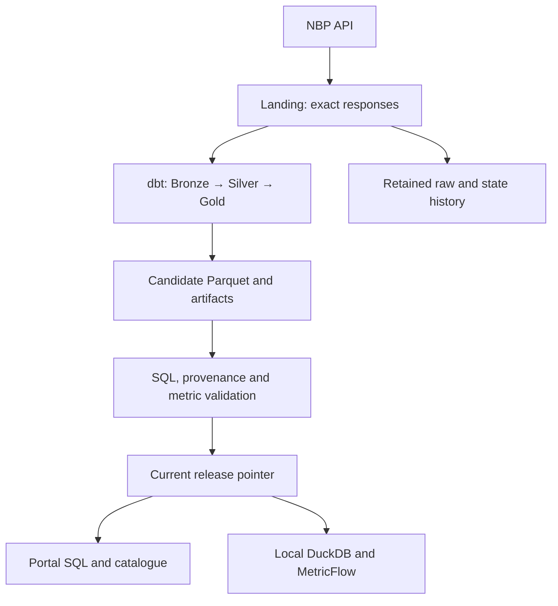

# Zohelo-data architecture

Current technical design for `zohelo-data` and `data.zohelo.com`. The umbrella `zohelo.com` site and other subprojects are outside this scope. Delivery/verification status lives in [the delivery record](deliverables.md). The [original proposal](history/2026-09-06-architecture-proposal.md) is historical evidence.

## Constraints and responsibilities

The initial user is the owner. Git stores definitions and tests; the existing Google Drive allocation stores durable data and release metadata. Computation runs on demand within measured limits. A human must be able to operate the system with standard tools and no AI.

| Concern | Tool / authority | Human-editable definition |
| --- | --- | --- |
| Provider identity, methodology, frequency, reuse evidence | YAML metadata | `config/sources.yaml` |
| Dated extraction, retry and recovery policy | Validated YAML plus source-specific Python adapter | `config/nbp-platform.yaml`, `src/ingestion/` |
| Transformations, keys, tests, dimensional models | dbt Core SQL/YAML on native DuckDB | `models/`, `macros/`, `dbt_tests/` |
| Daily source metrics | MetricFlow YAML and a query interface enforcing non-additive grain | `models/semantic/`, `scripts/query_metrics.py` |
| Durable files | Existing Drive, immutable raw/Parquet/artifacts | `config/storage.yaml`, `src/storage_manager.py` |
| Publication and recovery | Staged validation, immutable releases, explicit promotion | `src/release_protocol.py`, `src/release_validation.py` |
| Batch orchestration | GitHub Actions YAML, serialized production operations | [Workflow inventory](audits/2026-09-07-workflows.md) |
| SQL and discovery | React, DuckDB-WASM, one native dbt Docs viewer | `portal/`; [user guide](using-the-portal.md) |
| Native/offline consumption | Verified local DuckDB and matching semantic manifest | `scripts/restore_release.py`, `scripts/query_metrics.py` |
| Project status and decisions | One versioned GitHub record | [Delivery record](deliverables.md), [working agreement](collaboration.md) |

Python handles extraction, transport and release control. It does not introduce a second business transformation engine alongside dbt. Generic HTTP configuration alone cannot replace the NBP adapter's exact-response retention and revision guarantees.

## Data flow and storage

| Area | Meaning | Retention/query role |
| --- | --- | --- |
| `01_landing` | Exact received response bytes | Verified descriptors identify accepted build inputs. Rejected bytes remain evidence and are excluded from builds. |
| `02_bronze` | Source-shaped records with request, sequence and raw-file provenance | Preserve source observations and repeated representations. |
| `03_silver` | Typed current records and detected-change evidence | Preserve prior values when absence needs investigation. |
| `04_gold` | Explicit-grain facts and conformed dimensions | FX: source table × publication date × currency. Gold: publication date × commodity. |
| `05_archive` and retained releases | Lifecycle, audit and recovery | Legacy moved files remain archived. V2 raw history stays immutable in Landing. No automatic destructive cleanup. |

Medallion describes progressively refined data quality; it does not require Spark or a particular storage product. Landing and Archive are additional lifecycle boundaries. [Medallion reference](https://learn.microsoft.com/en-us/azure/databricks/lakehouse/medallion).

Published physical files belong to an immutable release folder. Its manifest assigns logical layers, SQL names, file IDs and checksums. Consumers never infer current data from the most recently modified layer folder.

## Publication and recovery

The publisher saves validated ingestion progress after each request. It builds all 15 tables from pinned inputs, runs dbt tests and native MetricFlow acceptance queries, uploads a candidate, then verifies the uploaded Parquet and its provenance before changing `current-release.json`. Consumers pin the release once. Post-publication fresh reads and cold replay are additional evidence; their failure is not an automatic rollback.

Drive provides no database transaction or compare-and-swap for this protocol. Production operations use one Actions concurrency group and pointer-drift detection. Do not run another production writer outside that route. An ambiguous update response stops rather than claiming success. Retained-release promotion checks the expected current release and validates the target before switching.

`checked_through`, `latest_observation_date` and release identity describe different facts. Rebuild means recovery from retained input, not historical time travel; a regressive cutoff is rejected. `full` is a compatibility name for resumable catch-up, not a forced redownload of every historical interval.

Value changes are observed source changes, not claims of an official correction date/reason. Missing currency records in a returned publication are investigation candidates and do not delete current values. A 404 never authorizes deletion. Entire missing publications and versions predating retained responses cannot be reconstructed reliably. See [revision policy](decisions/0001-nbp-corrections.md) and [source definitions](nbp-business-definitions.md).

## Tool choices and change conditions

| Option | Decision | Reconsider when |
| --- | --- | --- |
| dbt + DuckDB | Keep: portable SQL/YAML definitions and tested NBP workload; local databases remain disposable. | Measured runtime, memory or concurrency exceeds the single-machine design. |
| dlt REST ingestion | Candidate for a future source; no speculative migration/dependency. Declarative endpoint, pagination and authentication configuration is useful, but must preserve raw/replay guarantees. | A selected source demonstrates lower total maintenance. [dlt REST source](https://dlthub.com/docs/dlt-ecosystem/verified-sources/rest_api/basic). |
| Dagster / Prefect / Airflow | Hold migration: current daily dependencies already live in Actions YAML. A new orchestrator adds operated services/state. | Independently scheduled sources, asset-level backfills or dependency-aware operations justify it. [Dagster deployment components](https://docs.dagster.io/deployment/oss/oss-deployment-architecture). |
| PySpark | Do not adopt for the current tens-of-MB input. | A benchmark establishes a distributed workload requirement. [Spark execution model](https://spark.apache.org/docs/latest/cluster-overview.html). |
| Jupyter | Optional analysis client, not transformation/scheduling authority. | Exploration benefits from notebooks; durable logic is promoted into tested code. |
| Object storage / transactional table format | Keep immutable Parquet on existing Drive. No active DuckDB file is maintained on Drive. | Multi-writer transactions, larger-scale pruning, automated retention or availability requirements justify migration. |
| Hosted semantic API | Hold: on-demand native MetricFlow and CSV are the present supported interface. | A specific BI/multi-user/always-on requirement supplies a hosting and authorization design. |

DuckDB can spill many operations to disk, but its memory setting does not bound every allocation. Browser download limits are not query-memory guarantees. [Workload guidance](https://duckdb.org/docs/lts/guides/performance/how_to_tune_workloads.html), [memory limitations](https://duckdb.org/docs/current/guides/performance/oom.html).

## Commercial use and cost boundaries

The pinned dbt Core and MetricFlow engine use Apache-2.0; MetricFlow's older versions had different terms. dlt also uses Apache-2.0 if adopted. Preserve Duck-UI's licence/attribution. The root project's own distribution licence remains an owner decision. [dbt licence](https://github.com/dbt-labs/dbt-core/blob/main/LICENSE), [MetricFlow licence history](https://github.com/dbt-labs/metricflow), [dlt licence](https://github.com/dlt-hub/dlt).

Software permission, data reuse permission and service allowances are separate. Public NBP access does not establish unrestricted commercial redistribution; the source metadata records the unresolved scope. Standard hosted Actions runners are documented as free for public repositories, subject to terms. Codespaces, private-repository allowances, larger runners and Drive capacity remain account-specific. [Actions billing](https://docs.github.com/en/actions/concepts/billing-and-usage), [Drive quotas](https://developers.google.com/workspace/drive/api/guides/limits).

GitHub Pages restricts operation of online businesses, commercial transactions and commercial SaaS. The present owner-focused project portal is not approval to launch a commercial hosted data product there. Revisit hosting before that change of use. [Pages limits](https://docs.github.com/en/pages/getting-started-with-github-pages/github-pages-limits).

## Operating envelope

This is a bounded owner platform, not an unlimited archive or availability promise. Raw/state/release history is retained; compaction and destructive cleanup remain separate work. Capacity reports must expose batch/byte headroom before more sources are admitted. Increasing state snapshots, browser downloads and native peak memory are measured constraints, not solved by nominal Drive capacity.

Use [the operating guide](nbp-platform-operations.md) to validate, publish, restore, query and recover without AI. The delivery record links actual CI/deployment/production evidence; this document is not proof of a live deployment.
