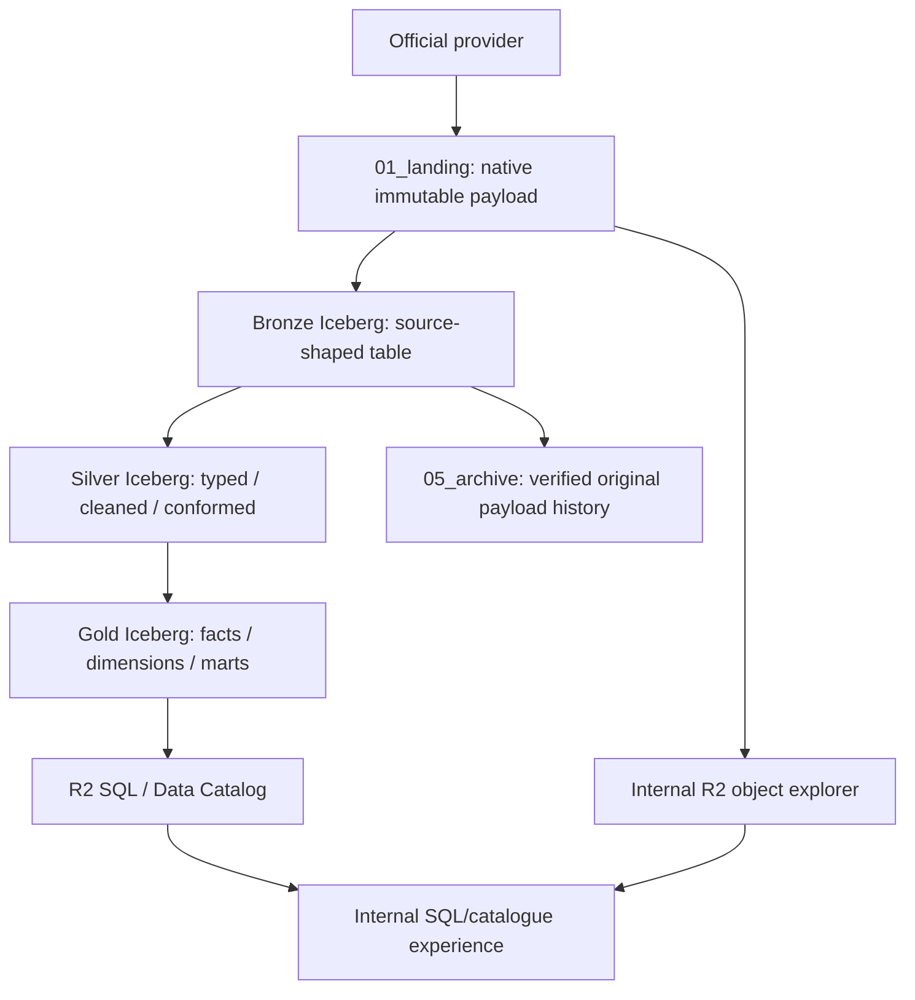

# Zohelo-data architecture

This document describes the production storage and operating architecture.
Layer responsibilities are the intended contract; they must not be read as proof
that every current table implements that contract. The implementation gaps and
owner's required review are recorded below. Historical Drive and release-folder
designs remain in version history, not as instructions for current operation.

## Principles

1. Cloudflare R2 is the durable production store.
2. Landing and Archive retain native provider payloads.
3. Bronze, Silver and Gold are Apache Iceberg v2 tables in R2 Data Catalog.
4. Internal data visibility does not require a publication/release workflow.
5. GitHub Actions performs bounded batch orchestration; it is not the query
   engine or the catalogue.
6. Google Drive is not a production dependency.
7. The portal uses Google identity only to authorize access to private R2 data.
8. Keep the platform operable with ordinary Python, SQL, GitHub Actions and
   Cloudflare tooling; do not introduce an orchestrator or distributed compute
   engine without measured need.

## Production storage

### `zohelo-landing-prod`

| Prefix | Purpose |
| --- | --- |
| `01_landing/` | Exact/native current source responses and distributions. |
| `05_archive/` | Verified historical raw payloads retained for recovery/audit. |

### `zohelo-lakehouse-prod`

| Area | Purpose |
| --- | --- |
| Iceberg `bronze` | Source-shaped analytical tables. |
| Iceberg `silver` | Typed, cleaned, deduplicated/conformed tables. |
| Iceberg `gold` | Facts, dimensions, marts and semantic-ready relations. |
| `06_control/` | Campaign state, receipts, checkpoints, portal index and operational metadata. |
| R2 Data Catalog metadata | Iceberg metadata managed through Cloudflare's catalog. |

Legacy `releases/` and layer `current/` prefixes were removed after Iceberg
references were relocated and representative R2 SQL queries passed before and
after deletion.

## Data flow

```mermaid
flowchart TD
  A["Official provider"] --> B["01_landing: native immutable payload"]
  B --> C["Bronze Iceberg: source-shaped table"]
  C --> D["Silver Iceberg: typed / cleaned / conformed"]
  D --> E["Gold Iceberg: facts / dimensions / marts"]
  C --> F["05_archive: verified original payload history"]
  E --> G["R2 SQL / Data Catalog"]
  B --> H["Internal R2 object explorer"]
  G --> I["Internal SQL/catalogue experience"]
  H --> I
```

The exact retention/deletion gates are defined in
[data-lifecycle.md](data-lifecycle.md). In particular, Landing is not removed
just because ingestion succeeded: Bronze must commit and validate, and the raw
archive copy must be verified before a Landing object is eligible for removal.

## Ingestion

The production ingestion backend is R2.

Two storage modes are supported:

- **standard API campaigns** — exact response bytes, receipts and resumable state
  through `R2CampaignStore`;
- **full-distribution campaigns** — large native objects through
  `BulkR2RawStore`, with campaign/control state in R2.

The **Ingestion (R2 manual)** workflow exposes explicit manual operations for
smoke verification, standard campaigns and supported bulk campaigns. It has no
schedule.

Optional GUS BDL/DBW API credentials are supplied only as transport headers and
are never written into durable request/receipt state.

## Transformations and Iceberg

Existing Parquet was migrated into Iceberg without unnecessary full rewrites.
Where a Silver or Gold relation is intentionally identical to its upstream
relation, the current partial-data platform may use zero-copy Iceberg references
instead of duplicating bytes. When a transformation changes rows, columns or
business grain, the target layer must own transformed data files.

Current-data promotion is idempotent and validates representative R2 SQL reads.
The one-time migration also normalized historical Eurostat Bronze objects that
had misleading `.bin` names even though their bytes were Parquet.

Iceberg compaction/snapshot maintenance is a separate maintenance concern. Do
not use compaction as a substitute for source transformation.

## Query and portal

The object explorer reads private R2 through the portal Cloudflare Worker. The
browser never receives R2 writer credentials. Signed, short-lived Worker URLs are
used for file open/download.

The current portal keeps Google sign-in as identity/authentication. Google Drive
data access is not requested or used.

R2 Data Catalog/R2 SQL is the authoritative analytical query plane for Iceberg
tables. Any remaining compatibility code that refers to historical Drive/release
concepts is legacy implementation debt and must not be used to recreate a
release-folder architecture.

## Workflows

Only these workflows are operational:

1. `ingestion.yml` — manual R2 ingestion.
2. `transform.yml` — R2/Iceberg transformations and bounded maintenance.
3. `deploy-portal.yml` — internal portal deployment and R2 portal index.

There are no repository regression-test workflows and no scheduled ingestion.

## Recovery and safety

- Raw provider payloads are immutable.
- Campaign/checkpoint writes are resumable and source-scoped.
- Destructive cleanup is downstream-gated and validated before deletion.
- An R2/Iceberg table migration does not imply complete official source
  coverage; coverage claims remain source-specific.
- A failed source or transformation run must preserve prior accepted state.
- New paid infrastructure, distributed compute, or a customer-facing
  publication layer requires a separate decision.

## Future external publishing

The current portal is an internal owner platform. If data.zohelo.com later
becomes a customer endpoint, add a separate external publication/access layer
above Gold with explicit customer datasets, versions, authorization, contracts
and release semantics. Do not reintroduce those concerns into the internal
storage lifecycle.

## Owner review before ingestion resumes — 2 October 2026

Reconcile retained R2 inputs first. Then present the owner with the actual and
intended flow, source exceptions, executable steps and implementation gaps before
any ingestion resumes. Reconciliation completion alone does not authorize new
provider calls. Keep ingestion paused until a later owner instruction to resume.

### Verified implementation gaps

- The active Transformations workflow calls Python/PyIceberg operations and
  does not execute dbt.
- The current promotion mapping covers 20 Bronze tables and corresponding
  Silver/Gold tables. Copying their files or sharing the same Iceberg file
  references does not perform cleansing, joins or dimensional modeling.
  Existing source-specific BDL, Eurostat, NBP and WDI modeled tables are outside
  that pass-through mapping.
- The checked-in dbt profile targets a local DuckDB database and models use
  local Parquet sources. A production dbt path that reads the R2 Bronze tables
  and commits Silver/Gold Iceberg snapshots is not configured.
- Current Eurostat reconciliation writes `bronze.eurostat_full_observations`.
  Legacy Eurostat dbt models read a different local decoded source. Running those
  old models unchanged does not establish coverage of the reconciled bulk data.
- Source-specific dimension tables exist, but shared cross-source entity keys,
  effective-dated mappings and consistent measures are not established across
  BDL, DBW, Eurostat and WDI.
- Source completeness, exact retained-input reconciliation, table format,
  cleansing and integrated Gold semantics are separate acceptance claims.

### Requested target and stage boundaries

| Stage | Responsibility | Common versus source-specific |
| --- | --- | --- |
| Provider to Landing | Save exact native response/distribution bytes with identity, timestamp, hash and checkpoint. | Shared storage/retry/checkpoint behavior; source-specific transport and pagination. |
| Landing to Bronze | Parse/decompress and represent records as source-faithful Iceberg tables, retaining codes, dimensions, flags, source-row identity and raw lineage. | Shared writer/provenance; source-specific JSON, TSV, CSV, XML, ZIP and schema parsers. |
| Bronze to Silver | dbt-led typing, controlled normalization, duplicate/revision handling, explicit missing/invalid statuses and canonical entity/code mappings. | Reusable macros plus explicit dataset keys, rule parameters and source semantics. |
| Silver to Gold | dbt-led dimensional products: conformed dimensions, fact grain, measure definitions and approved aggregates. | Shared dimensions where meaning agrees; domain-specific facts and aggregation rules. |
| Landing to Archive | Preserve original raw payloads after Bronze acceptance and verify full hash readback. Remove eligible Landing only after recovery references are safe. | Shared lifecycle; format-aware compression and source-specific reference handling. |

Iceberg is a table format over data files, normally Parquet; the catalog tracks
table metadata and snapshots. dbt describes and orders transformation models;
an explicitly configured adapter and compute engine execute SQL and write the
target tables. R2 storage, Iceberg, dbt, compute and GitHub Actions have separate
roles. Prove the actual production read/write path before describing it as done.

Bronze permits structural work needed to expose records (for example decoding
SDMX dimensions or reshaping a wide source period layout), while preserving the
source meaning and recoverable originals. It must not silently repair values,
merge indicators, select business winners or discard provider status codes.

Silver is the reusable authoritative data layer, consisting of multiple governed
tables. Entity identity and source-to-canonical mappings belong here so data
science and Gold use the same definitions. Keep original values, source codes,
provenance, quality status and revision history where relevant. Missing,
suppressed, not-applicable and invalid observations are distinct from zero.
Unknown business values are not automatically imputed. Preserve rejected or
unparseable material with reasons rather than silently deleting it.

Use a common library of small dbt macros for applicable operations and explicit
per-dataset configuration for keys, types, null meanings, deduplication,
revisions, allowed codes and unit conversions. A universal script applying every
cleaning operation to every table would change source meanings incorrectly.

Gold integrates sources through shared conformed dimensions such as geography,
period, indicator/concept, unit, source and relevant classifications (sex, age,
industry, etc.). Preserve effective dates and mapping provenance. Each fact uses
the applicable dimensions; unrelated facts need not share all dimensions.
A shared geography model may distinguish territorial levels and boundary vintages.
Role-specific views may reuse one entity dimension.

Statistical observations may correctly remain in long form: one measurement for
a fully defined dimensional tuple and period. BDL, DBW and Eurostat encode parts
of that tuple differently. Retain the full tuple, decode source dictionaries,
map source members to canonical keys and preserve unmapped/ambiguous cases.
Do not pivot every indicator into a column or collapse observations to
indicator/geography/year when additional dimensions define their grain.

Consolidate facts only when grain, measure definition, population, unit, frequency,
adjustment and time/geography interpretation are compatible. Preserve source
and revision identities; do not sum duplicated published statistics across
providers. Percentages, indices and stocks need explicit aggregation rules.
Prefer a coherent model with shared dimensions and appropriately grained fact
tables over forcing every source into one universal fact table.

### Review deliverable

For every actual dataset/table, provide a compact mapping of:
input → output; transformation steps; code/model and execution engine;
natural/business key; source-specific rules; increment/revision behavior;
quality outcomes; failure/resume behavior; archive/deletion eligibility;
and the shared Gold dimensions/fact grain it supports.

Include a fact-by-dimension matrix and explicitly mark which parts are implemented,
currently pass-through, absent, or require a design decision. Explain dataflow
separately from the three operational workflows. These requirements do not
authorize new frameworks, additional workflows, test suites or a compute migration.

Reference concepts:
- [Apache Iceberg table specification](https://iceberg.apache.org/spec/)
- [dbt adapters and execution platforms](https://docs.getdbt.com/docs/supported-data-platforms)
- [Conformed dimensions](https://www.kimballgroup.com/2011/06/design-tip-135-conformed-dimensions-as-the-foundation-for-agile-data-warehousing/)
- [Fact consolidation requires compatible grain](https://www.kimballgroup.com/data-warehouse-business-intelligence-resources/kimball-techniques/dimensional-modeling-techniques/consolidated-fact-table/)
