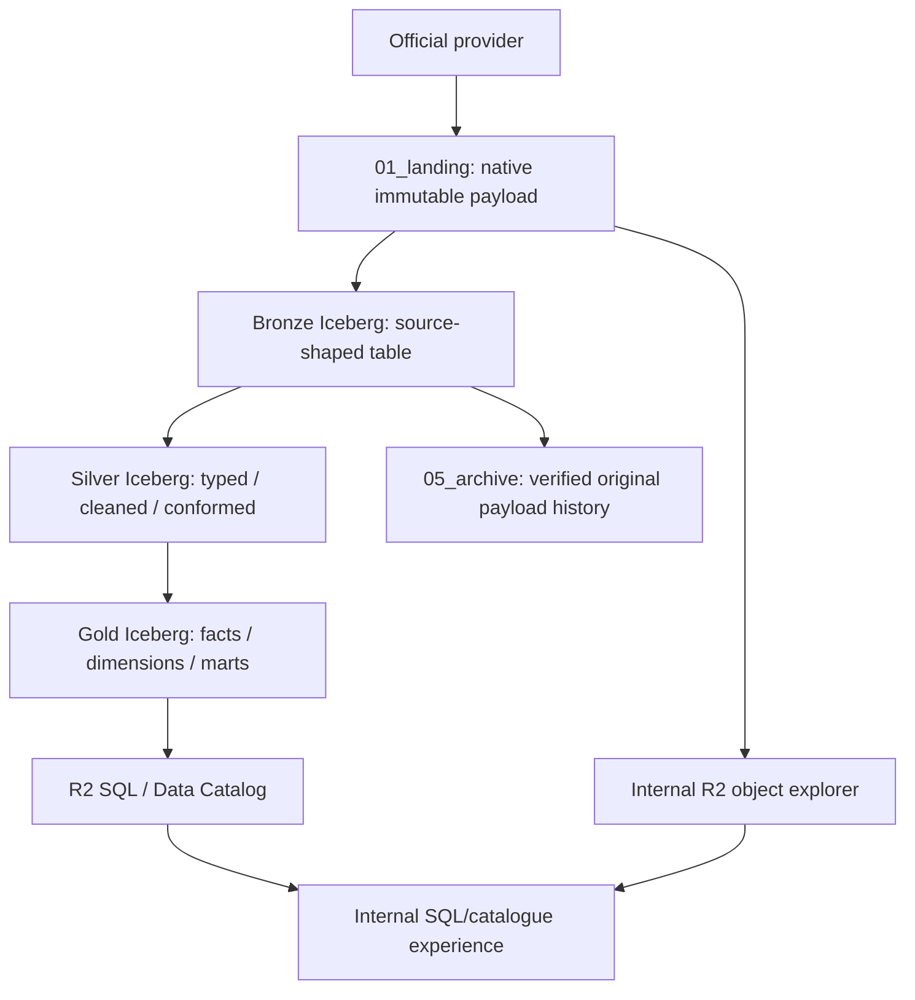

# Zohelo-data architecture

This document describes the current production architecture. Historical Drive
and release-folder designs remain in version history and decision records; they
are not instructions for current operation.

## Principles

1. Cloudflare R2 is the durable production store.
2. Landing and Archive retain native provider payloads.
3. Bronze, Silver and Gold are Apache Iceberg v2 tables in R2 Data Catalog.
4. Internal data visibility does not require a publication/release workflow.
5. GitHub Actions performs bounded batch orchestration; it is not the query
   engine or the catalogue.
6. Google Drive is not a production dependency.
7. The portal uses Google identity only to authorize access to private R2 data.
8. Keep the platform operable with ordinary Python, SQL, GitHub Actions and
   Cloudflare tooling; do not introduce an orchestrator or distributed compute
   engine without measured need.

## Production storage

### `zohelo-landing-prod`

| Prefix | Purpose |
| --- | --- |
| `01_landing/` | Exact/native current source responses and distributions. |
| `05_archive/` | Verified historical raw payloads retained for recovery/audit. |

### `zohelo-lakehouse-prod`

| Area | Purpose |
| --- | --- |
| Iceberg `bronze` | Source-shaped analytical tables. |
| Iceberg `silver` | Typed, cleaned, deduplicated/conformed tables. |
| Iceberg `gold` | Facts, dimensions, marts and semantic-ready relations. |
| `06_control/` | Campaign state, receipts, checkpoints, portal index and operational metadata. |
| R2 Data Catalog metadata | Iceberg metadata managed through Cloudflare's catalog. |

Legacy `releases/` and layer `current/` prefixes were removed after Iceberg
references were relocated and representative R2 SQL queries passed before and
after deletion.

## Data flow

```mermaid
flowchart TD
  A["Official provider"] --> B["01_landing: native immutable payload"]
  B --> C["Bronze Iceberg: source-shaped table"]
  C --> D["Silver Iceberg: typed / cleaned / conformed"]
  D --> E["Gold Iceberg: facts / dimensions / marts"]
  C --> F["05_archive: verified original payload history"]
  E --> G["R2 SQL / Data Catalog"]
  B --> H["Internal R2 object explorer"]
  G --> I["Internal SQL/catalogue experience"]
  H --> I
```

The exact retention/deletion gates are defined in
[data-lifecycle.md](data-lifecycle.md). In particular, Landing is not removed
just because ingestion succeeded: Bronze must commit and validate, and the raw
archive copy must be verified before a Landing object is eligible for removal.

## Ingestion

The production ingestion backend is R2.

Two storage modes are supported:

- **standard API campaigns** — exact response bytes, receipts and resumable state
  through `R2CampaignStore`;
- **full-distribution campaigns** — large native objects through
  `BulkR2RawStore`, with campaign/control state in R2.

The **Ingestion (R2 manual)** workflow exposes explicit manual operations for
smoke verification, standard campaigns and supported bulk campaigns. It has no
schedule.

Optional GUS BDL/DBW API credentials are supplied only as transport headers and
are never written into durable request/receipt state.

## Transformations and Iceberg

Existing Parquet was migrated into Iceberg without unnecessary full rewrites.
Where a Silver or Gold relation is intentionally identical to its upstream
relation, the current partial-data platform may use zero-copy Iceberg references
instead of duplicating bytes. When a transformation changes rows, columns or
business grain, the target layer must own transformed data files.

Current-data promotion is idempotent and validates representative R2 SQL reads.
The one-time migration also normalized historical Eurostat Bronze objects that
had misleading `.bin` names even though their bytes were Parquet.

Iceberg compaction/snapshot maintenance is a separate maintenance concern. Do
not use compaction as a substitute for source transformation.

## Query and portal

The object explorer reads private R2 through the portal Cloudflare Worker. The
browser never receives R2 writer credentials. Signed, short-lived Worker URLs are
used for file open/download.

The current portal keeps Google sign-in as identity/authentication. Google Drive
data access is not requested or used.

R2 Data Catalog/R2 SQL is the authoritative analytical query plane for Iceberg
tables. Any remaining compatibility code that refers to historical Drive/release
concepts is legacy implementation debt and must not be used to recreate a
release-folder architecture.

## Workflows

Only these workflows are operational:

1. `ingestion.yml` — manual R2 ingestion.
2. `transform.yml` — R2/Iceberg transformations and bounded maintenance.
3. `deploy-portal.yml` — internal portal deployment and R2 portal index.

There are no repository regression-test workflows and no scheduled ingestion.

## Recovery and safety

- Raw provider payloads are immutable.
- Campaign/checkpoint writes are resumable and source-scoped.
- Destructive cleanup is downstream-gated and validated before deletion.
- An R2/Iceberg table migration does not imply complete official source
  coverage; coverage claims remain source-specific.
- A failed source or transformation run must preserve prior accepted state.
- New paid infrastructure, distributed compute, or a customer-facing
  publication layer requires a separate decision.

## Future external publishing

The current portal is an internal owner platform. If data.zohelo.com later
becomes a customer endpoint, add a separate external publication/access layer
above Gold with explicit customer datasets, versions, authorization, contracts
and release semantics. Do not reintroduce those concerns into the internal
storage lifecycle.
