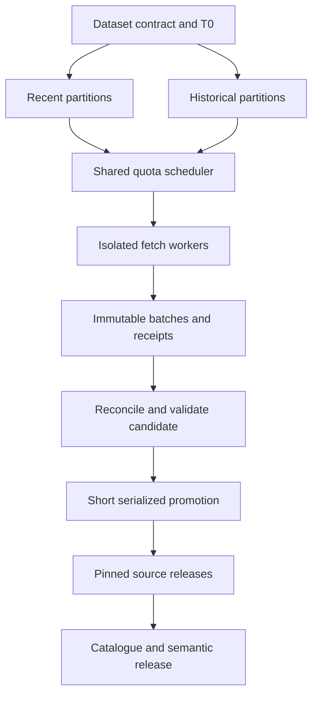

# Ingestion and cross-source modeling proposal

Research date: 8 September 2026. **Design for review; not implemented or connection-tested.**
The owner's requirements are accepted; the technical choices below are recommendations
to validate against selected datasets. The existing NBP release and schedule are unchanged.

## What the current platform can and cannot be reused for

Keep Python for extraction and transport, dbt SQL/YAML for transformations, native DuckDB
for bounded computation, immutable files for recovery, and the release-bound catalogue.
These are human-operable foundations. The breadth of this inventory does not itself justify
buying a platform or migrating to Spark, Airflow or a hosted database.

Current code has three relevant boundaries:

1. `src/release_protocol.py` binds format v2 to the `nbp_platform` scope and exactly 15
   datasets. The portal validator also understands a specific NBP release contract.
   Adding another source requires a versioned contract and compatible consumers.
2. `src/ingestion/nbp_state.py::plan_requests` schedules old coverage holes before recent
   rechecks for each source. That is the existing NBP recovery policy, not the requested
   general live-first backfill policy.
3. `.github/workflows/daily-ingestion.yml` serializes the entire production workflow in
   `zohelo-production-data`. Long backfills placed in that group would delay fresh work.
   NBP's batch, raw-byte and state-size caps and the browser's download budget are real
   implementation limits, not universal capacity for hundreds of sources.

These are scoped extension requirements for onboarding, not evidence that the completed
NBP delivery is broken. Preserve the NBP v2 reader and release while a new format is tested.
See the [current architecture](../architecture.md), [release protocol](../../src/release_protocol.py),
[planner](../../src/ingestion/nbp_state.py), and [workflow](../../.github/workflows/daily-ingestion.yml).

## A durable registry with separate levels

Use a hierarchy of **provider → product → dataset family → dataset → distribution or
service → partition**. A provider can publish several products; an API and a CSV file can
represent the same dataset. Catalogue mirrors should point to the original publisher.
This is compatible with DCAT's distinction between datasets, distributions, services and
dataset series, without requiring the project to introduce an RDF store.
[W3C DCAT 3](https://www.w3.org/TR/vocab-dcat-3/).

The research inventory identifies products/families. Onboarding must expand each chosen
family into specific datasets and preserve:

| Registry area | Required fields |
| --- | --- |
| Identity | Stable internal ID; provider/product/dataset codes; original publisher; upstream lineage |
| Meaning | English description; original source label and language; universe; grain; units; classifications and versions |
| Coverage | Geography; time bounds; known gaps; frequency; publication lag; observation-status flags |
| Access | Documentation URL; distribution or service; authentication; quota scope; page/query limits; known outage behavior |
| Rights | Dataset/distribution licence; attribution; derivative/redistribution restrictions; retention requirements; evidence and review date |
| Loading | Partition strategy; supported history; change-detection method; revision lookback; deletion semantics; schema drift behavior |
| Operations | Cursor/checkpoint; partition coverage; attempts/success; request/byte/time counters; health thresholds |
| Publication | Immutable batch and release IDs; source revisions; hashes; build/semantic versions; validation evidence |

The registry is declarative configuration plus versioned metadata. It must not become a
second hand-written catalogue in the portal or a replacement for dbt lineage.

Before collection, the selected contract must identify the permitted operations for the
specific distribution and intended use: collect, retain, transform and publish. Record the
allowed fields and any retention, expiry or downstream-use constraints, and enforce those
constraints in extraction and publication. Public lookup access is not sufficient evidence
for bulk collection. Unresolved operations remain outside the selected connection test.

## Live collection while history is loading

At onboarding, record an immutable boundary `T0` using the source's time semantics.
For a Polish publication day, store its Europe/Warsaw date and convert timestamp instants
to UTC; do not substitute UTC midnight for every provider's publication boundary. Start
recent collection immediately where the interface permits it. A monthly dataset does not
become daily data because the scheduler checks it daily.

Maintain independent work queues and checkpoints for recent work, historical work and
reconciliation. Their workers may run concurrently only when storage, quota and runner
budgets support it. A smaller initial implementation may alternate short chunks with
recent work always taking priority. In either arrangement, no entire historical job holds
the publication lock. The maximum delay is a bounded in-flight chunk/build, not the full
backfill. A strict freshness target would need measured capacity and an explicit target.

**Proposed invariants:**

- Recent work has a reserved request/byte/time allowance. History uses spare allowance;
  it cannot exhaust a shared daily vendor quota before the next recent-data window.
  Also reserve a feasible minimum historical allowance or use aging priority so history
  cannot starve indefinitely. Track backfill progress and estimated completion from measured
  throughput. If capacity cannot sustain both targets, narrow the admitted scope or revisit
  the targets; do not silently promise eventual completion. Paused or abandoned history
  remains explicitly incomplete.
- Quotas are enforced at their actual scope: API key, account, IP, endpoint and/or provider.
  Two workers each obeying a per-worker limit can still violate the provider's total limit.
- Workers write append-only response objects and receipts under assigned identities.
  They do not independently replace the same mutable checkpoint or release pointer.
- One coordinator owns checkpoint consolidation and promotion. Drive does not provide
  database-style compare-and-swap for the existing protocol; parallelism must not weaken it.
- Completed partitions, failed partitions and explicitly unavailable periods are separate.
  A successful recent partition is publishable with `history_status=building` and explicit
  coverage, but must never be labelled a fully complete historical dataset.
- Backfill is resumable after each validated page/chunk. A crash repeats at most bounded
  idempotent work. Cancellation or a lost workflow invocation does not lose the durable queue.
- Each source's failure is isolated. Other sources may publish new versions; cross-source
  marts explicitly pin the last valid combination of inputs and disclose their timestamps.
- Validation precedes publication. After a bad candidate, readers keep the previous
  compatible source release; a failed historical partition never clears current observations.

GitHub Actions concurrency is useful serialization, not a durable task ledger or a freshness
scheduler. Its default queue retains only one pending run; current documentation also
offers `queue: max`, with a bounded larger queue. Neither setting supplies per-source
priority or deduplication. Keep durable work items independently of workflow invocations.
[GitHub concurrency documentation](https://docs.github.com/en/actions/how-tos/write-workflows/choose-when-workflows-run/control-workflow-concurrency).

## Loading patterns must follow source capabilities

| Pattern | Initial history proposal | Continuing collection | Important boundary |
| --- | --- | --- | --- |
| Versioned bulk snapshot + deltas | Pin snapshot identity; retain deltas arriving while it loads; replay from compatible sequence | Apply ordered delta files; verify sequence; recover missed sequence from fresh snapshot | A latest-state dump is not a reconstruction of all former states |
| Partitioned statistical API | Discover codes/structure; partition by dataset, geography, dimensions and time; cache structure | Recent periods plus scheduled older revision sweeps; use change metadata where documented | A period filter is not a change feed; old observations can be revised |
| Bulk-only current file | Download to candidate, hash, validate, promote | Conditional download when supported; compare complete snapshots | No promise of true incremental transport; row-level change detection occurs locally |
| Cursor or event API | Capture recent cursor first if retained; historical endpoint separately | Persist ordered cursor; replay overlap and deduplicate event IDs | Cursor expiry/retention can make missing history unrecoverable |
| Entity lookup register | Obtain an authorized entity inventory/bulk route first | Use supported change lists or bounded known-entity refresh | Sequential ID guessing is not an approved full-load strategy |
| Filings/document corpus | Inventory document IDs and authoritative versions; fetch allowed documents | New/revised filing discovery; retain amendments and parse versions | OCR/extraction needs evidence and confidence; missing documents are not zero values |
| Geospatial objects | Pin CRS, geometry schema, boundary vintage and licensed region extracts | Change feed if provided; otherwise compare snapshots/tiles | WMS images are not feature records; a new geometry can affect many historical joins |
| Live telemetry/GTFS realtime | Start collection if lawful and useful; locate a separate archive | Poll/stream at permitted frequency with observed_at timestamps | Today's endpoint cannot reconstruct unrecorded past positions or metrics |
| Account-scoped commercial API | Import only authorized account data within its permissions | Refresh authorized resources and comply with retention/deletion rules | It does not expose every company, user or worldwide historical record |

GLEIF is a concrete documented example of bulk plus deltas; many other products do not
offer this combination. Validate snapshot/delta compatibility for the selected file set.
[GLEIF Golden Copy and Delta Files](https://www.gleif.org/en/lei-data/gleif-golden-copy/download-the-golden-copy).

For HTTP sources, use entity validators and conditional requests only when the selected
server supports them. Respect response backoff instructions; record bounded retries and
terminal failures. Do not assume an ETag is a source business revision or that an unchanged
listing implies every linked data file is unchanged.
[HTTP semantics](https://datatracker.ietf.org/doc/html/rfc9110).

## Backfill conflicts and honest completeness

Store at least four separate clocks: **observation/effective period**, **provider publication
or revision time**, **retrieval time**, and **platform publication time**. Some are absent;
absence must remain explicit.

A historical worker finishing later must not automatically overwrite fresher authoritative
data. Resolve conflicts using the source's explicit version/sequence when available. If it
is unavailable, keep both representations and apply a documented rule appropriate to the
interface: e.g. re-fetch the overlapping partition under one controlled request after the
backfill, or quarantine inconsistent snapshots. Arrival order alone is not a general
cross-source revision policy. A provider revising an old year is different from the platform
changing its parser or an aggregate publisher changing methodology.

For a paginated API without a snapshot token, records can move while pages are fetched.
Prefer stable key ordering and bounded date/key intervals when supported. Otherwise
reconcile page totals and keysets with overlapping passes; do not claim a transactionally
consistent full snapshot from one offset-paginated crawl. Save exact query parameters,
responses, content hashes, parser version and receipts for reconstruction within allowed retention.

Expose `recent_checked_through`, `history_target`, completed partitions, known gaps,
earliest retained observation, earliest retained snapshot, latest observation, last attempt,
last success, publication lag and unresolved conflicts. Calculate completeness against a
declared universe, never from `MAX(date)` or a successful HTTP status alone. Withdrawal
or deletion needs comparable successful source evidence and a source-specific rule.

## Silver: preserve source meaning and identity

Use typed source-specific tables rather than flattening all providers into one ambiguous
universal table. A reusable statistical-observation shape can work *within a compatible
family*, with full dimension keys and typed attributes; it is not a mandate to put financial
filings, weather sensors, legal acts and company registers into one entity-attribute-value table.

Retain source IDs, codes, original labels, units, geographic and classification vintages,
status flags, time roles, lineage and source versions. English descriptions supplement
original metadata; they do not alter source strings or silently translate categories. Distinguish
missing, unavailable, not applicable, suppressed, provisional and zero. SDMX explicitly
separates dimensions, attributes and observations, which is useful guidance for statistical
adapters. [ABS SDMX guide](https://www.abs.gov.au/statistics/application-programming-interfaces-apis/data-api-user-guide/understanding-sdmx-data).

Preserve overlapping providers as separate silver records. Give a derived view an explicit
preferred-source rule and mapping evidence. Do not collapse the same indicator from GUS,
Eurostat, OECD and World Bank based on similar labels; universes, vintages and revisions
may differ. Lineage can identify republished data without pretending to establish statistical equality.

## Gold: shared dimensions and multiple fact grains

| Conformed dimension / bridge | Proposed keys and cautions |
| --- | --- |
| Geography and geography version | Country codes plus source codes; TERYT/TERC, NUTS/LAU/KTS crosswalks with validity dates; retain statistical vs administrative roles |
| Time period and calendar | Daily instants, month/quarter/year, fiscal year, school year, reference dates and publication dates; no invented daily expansion of annual values |
| Business identity and identifiers | Distinct legal person, permitted person/sole-trader, business activity, establishment and register-entry entities; namespaced KRS/NIP/REGON/LEI/CIK assertions; time-valid, evidence-backed links |
| Classification and concept | PKD/NACE, occupation, COICOP/commodity classifications, education and disease taxonomies; versioned mappings, including many-to-many relationships |
| Unit, scale and price basis | Currency, unit multiplier, nominal/real/PPP, index base year, seasonality and adjustment; conversions as explicit transformations |
| Population and methodology | Age, sex, household/person/establishment universe, denominator, residence/workplace basis, survey/admin methodology and confidence flags |
| Instrument, commodity, facility, station | Domain identifiers remain domain-specific; do not merge securities with issuers or stations with municipalities |
| Source, release and version | Original producer, republisher, publication vintage, pipeline contract and source-release identifiers |

TERYT contains distinct territorial, locality and street systems; these are not interchangeable
keys. Eurostat publishes classification correspondence tables whose vintages must be
preserved. A modern administrative hierarchy cannot be assumed to describe historical
data. [TERYT](https://eteryt.stat.gov.pl/eTeryt/english.aspx),
[Eurostat correspondence tables](https://ec.europa.eu/eurostat/web/nuts/correspondence-tables).

Do not join fine-grained geography to coarser observations and replicate values as if they
were measured locally. Boundary changes may require a many-to-many bridge; allocation
weights are optional analytical assumptions, not facts obtained from a code crosswalk.
Use source-native historical boundaries unless a separately approved harmonization exists.

An identifier assertion links one namespace and value to a specific entity with evidence
and validity dates. A CEIDG activity, its proprietor, a REGON local unit and a KRS legal
person are not interchangeable records. Beneficial ownership is a typed person/entity
relationship with source evidence, not another organization name. Unresolved matches stay
unresolved; only fields permitted by the selected contract enter these models.

| Proposed gold fact family | Grain | Typical dimensions | Semantic rule to enforce |
| --- | --- | --- | --- |
| Macroeconomic observation | Series × area × reference period × source vintage | Geography, period, concept, unit, source | GDP levels, growth, indices and stocks have different aggregation rules |
| Local population/social statistic | Area-version × period × population slice × measure × source | Geography, population, methodology | Compatible categories and geographic levels only; rates require denominators |
| Business/register snapshot/change | Typed entity or register entry × as-of date or actual event | Entity type, identifier bridge, classification, geography | Define the counted population; legal persons, activities and establishments differ |
| Financial statement item | Filing × reporting entity × concept × period × dimensional context × unit | Organization, taxonomy, period, currency | Separate duration/instant facts, consolidated/separate accounts and amendments |
| Procurement notices and awards | Separate notice-version, lot, award and contract/amendment facts, linked to procedure IDs | Buyer, supplier/party bridge, geography, classification | One award is counted once; publication versions and many-party joins must not multiply values |
| Public finance flow/stock | Government unit × reporting period × budget classification × accounting basis | Organization, geography, period, concept | Commitments, execution, debt and transfers differ; consolidate inter-unit flows explicitly |
| Health service or outcome statistic | Published aggregate cell or provider × period × service | Facility, geography, population, classification | Claims, visits, patients and waiting lists are distinct units and universes |
| Education/labour outcome | Institution/cohort/area × period × measure | Organization, geography, population, classification | Academic year, cohort and employment outcomes cannot share an implicit denominator |
| Environmental observation | Station/grid-cell × parameter × interval × validation status | Station, geography, unit, time | Irregular readings need coverage-aware aggregation; coordinates/quality can change |
| Electricity/gas balance | Area/asset × market interval × measure × publication | Asset, market zone, unit, time | MW power differs from MWh energy; settlement intervals and revisions matter |
| Transport observation/event | Route/segment/stop/vehicle aggregate × time or event | Infrastructure, geography, mode, calendar | Timetable, actual arrivals, counts and accidents are separate fact families |
| Public document and procedure | Separate document-version and domain procedural/status-event facts | Issuer, document type, procedure, date role, source | Preserve legal status/finality, amendments, attachments and extraction provenance |
| Platform content snapshot | Platform × content/account ID × retrieval time | Platform, permitted account, time | Current cumulative engagement is a snapshot; no historic metric reconstruction |
| Geospatial feature version | Feature-ID × geometry/attribute validity interval | Geography, feature type, CRS, source | Geometry objects support dimensional/spatial joins, not forced additive facts |

For public documents distinguish the intellectual document, its language or amended text,
the published file, and the retrieved version. Link attachments and redacted replacements
explicitly. Model legislation, parliamentary procedure, audits, regulatory decisions and
financial filings in their own domain tables. A procedural event is not a new underlying
document merely because another portal republishes it. Extracted claims retain their exact
document version and page/section evidence; extraction confidence is separate from the
authority or finality of the source statement.

Conform dimensions where meaning genuinely matches. Query multiple facts separately at
the same approved grain, then align aggregates. Joining raw fact tables on country/year
can multiply rows and distort totals. This follows the dimensional-modeling practice of
drilling across conformed attributes. [Kimball drilling across](https://www.kimballgroup.com/data-warehouse-business-intelligence-resources/kimball-techniques/dimensional-modeling-techniques/drilling-across/).

Example review questions for modeling—not approved metric definitions—include Polish
municipality population with service availability; firm sector with public procurement;
and Poland/EU labour comparisons. Each needs a written join contract, relationship
cardinality, coverage test and an independently calculated acceptance example.

## Semantic layer: all onboarded sources represented meaningfully

Each accepted source should have a path into silver, domain gold and documented semantic
entities/relationships. That does not mean inventing a numeric metric for every document,
register field or geometry. Reference sources can supply conformed dimensions; an audit
document corpus can expose a defined document/event model, with extracted claims kept
separate from verified numeric observations.

For every implemented metric record: business definition; fact grain; entity; supported
dimensions; numerator/denominator; units/scale; allowed time and geography aggregation;
missing/suppressed-value treatment; revision policy; valid date roles; source/release lineage;
examples and expected results. Counts, balances, averages, medians, percentages and indices
must not all default to SUM. Rates require compatible denominators; population snapshots
cannot be summed across time. Some sources will be dimensions rather than MetricFlow measures.

Keep source-defined observations distinct from Zohelo-derived calculations. A ratio or
currency conversion needs methodology review even when its input series are freely
available. Static documentation and browser SQL do not provide an always-on native
semantic service. Keep the current on-demand runtime boundary until a product needs otherwise.

## Release and performance design to test next

Use independently versioned source releases plus an immutable platform manifest that pins
the exact sources, reference dimensions, marts and semantic artifacts in a consistent view.
Rebuild only the affected partitions and downstream models. A new historical partition
must not force downloading every source into every browser session or rebuilding unrelated domains.

Introduce this as a compatible protocol extension, with explicit schema/version negotiation
and rollback. First measure a small two-source vertical slice. Native DuckDB and Parquet
remain candidates; large rasters, national telemetry or repeated huge snapshots may require
different storage/compute arrangements. No migration or additional service is selected here.

Partition choices depend on source size and access: time × region for statistics, filing
year/issuer for documents, region/feature type for spatial objects, and compact time windows
for telemetry. Avoid thousands of tiny files and unbounded JSON state snapshots. Estimate
history volume, daily churn, retained versions, processing memory and request costs before
admitting a source. Source rights may constrain retention; existing NBP preservation rules
do not automatically define another provider's permitted archival policy.

## Acceptance tests for the later connection/design stage

| Test | Required evidence before production onboarding |
| --- | --- |
| Access and terms | Intended endpoint and distribution; permitted credentials/use; exact quota scope; no hidden paid dependency |
| Representative data | Small bounded sample; observed schema/grain; keys; actual oldest/newest accessible periods; source totals |
| Full/recent concurrency | Recent updates continue while history makes measurable progress; shared budgets remain within limits; no shared-pointer race or silent history starvation |
| Crash/retry | Stop after several pages; resume without missing or duplicated observations; expired cursors handled explicitly |
| Moving pages/revisions | Changed totals/page order, late corrections, provisional values and overlapping worker responses |
| Publication safety | Failed candidate leaves last release queryable; source manifest drift detected; concurrent promoter refused |
| Modeling | Uniqueness, referential integrity, crosswalk validity/cardinality, geography changes, unit consistency and no fan-out totals |
| Semantic agreement | Native semantic output agrees with independently written SQL for each supported grain and edge case |
| Capacity | Measured request/byte/time, memory and retained-state costs for history and recent lanes; compaction trigger before existing bounds |
| Human operation | Documented commands/buttons to pause history, keep recent collection, resume, diagnose, restore and query without AI |

Only after this evidence should a source be declared onboarded. Documentation research
does not demonstrate that an endpoint works with this account or that its historical
coverage, current quota and published data match the documentation.
