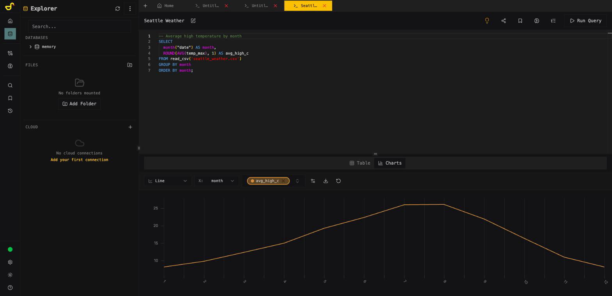
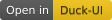

#  Duck-UI

**The fully open-source DuckDB workbench that runs in your browser.**

No install, no signup, no backend. Your data never leaves the tab.

[](LICENSE.md)
[](https://github.com/caioricciuti/duck-ui/stargazers)
[](https://github.com/caioricciuti/duck-ui/releases)
[](https://github.com/caioricciuti/duck-ui/pkgs/container/duck-ui)

**[Try it now → demo.duckui.com](https://demo.duckui.com?utm_source=github&utm_medium=readme)** · [Docs](https://duckui.com?utm_source=github&utm_medium=readme) · [Contributing](CONTRIBUTING.md)



Or run it yourself:

```bash
docker run -p 5522:5522 ghcr.io/caioricciuti/duck-ui:latest
```

Open `http://localhost:5522`. That's the whole setup.

## What you get

- **SQL editor** — Monaco with schema-aware autocomplete, formatting, snippets, multi-tab workspace, query history, saved queries, EXPLAIN viewer.
- **Notebooks** — SQL + markdown cells with per-cell results and charts.
- **Import anything** — CSV, JSON, Parquet, Arrow, XLSX, and `.duckdb` files. Drag-drop, from URL, or straight from S3/GCS/Azure/R2/MinIO.
- **Results grid** — virtualized scrolling, sorting, filtering, cell inspector, exports to CSV, JSON, XLSX, and Parquet.
- **Charts** — 16 chart types with per-series config, transforms, annotations, and PNG/SVG export.
- **Duck Brain (AI)** — text-to-SQL and one-click error fixing with your choice of provider: WebLLM fully in-browser (no API key, works offline), OpenAI, Anthropic, Chrome built-in AI, or any OpenAI-compatible endpoint (Ollama, DeepSeek, ...). Only your schema is ever sent, never your data — and with WebLLM, not even that.
- **Share and embed** — encode a whole analysis (query, notebook, chart config) into a URL. No server involved. Embed live, runnable queries in any page with an iframe or the `<duck-embed>` web component.
- **Persistence** — OPFS-backed local databases that survive reloads, profiles, encrypted credential storage (AES-256-GCM in your browser).
- **Connections** — in-memory WASM, persistent OPFS, external [DuckDB httpserver](https://github.com/quackscience/duckdb-extension-httpserver) instances. DuckLake catalogs attach via the embedded-database manifest, `?load=ducklake:` links, or plain ATTACH SQL.
- **Deploy anywhere** — Docker image, static hosting, GitHub Pages subpaths, air-gapped/offline setups, kiosk mode for publishing read-only datasets.

## Why Duck-UI and not the official `duckdb -ui`?

Both are good tools. The differences that matter:

| | Duck-UI | Official DuckDB UI |
|---|---|---|
| Frontend source | MIT, all of it in this repo | Closed source |
| Runs from | Any static host, Docker, or a URL | Local `duckdb` process, UI assets loaded remotely |
| Works offline / air-gapped | Yes | No |
| Self-host / embed / kiosk | Yes | No |
| AI assistant | Bring your own provider, or fully local WebLLM | MotherDuck account |
| External DuckDB servers | Yes (httpserver) | Local + MotherDuck only |

If you just want a quick local UI and don't care about any of that, the official one is fine. Duck-UI is for when the answers to "can I host it, embed it, extend it, run it offline, and read the code" need to be yes.

## "Open in Duck-UI" links

Any hosted dataset can become a one-click, runnable analysis. Add `?load=` (and optionally `&sql=`) to the app URL — [try this one](https://demo.duckui.com/?load=https://blobs.duckdb.org/stations.parquet&sql=SELECT%20country%2C%20count(*)%20AS%20stations%20FROM%20stations%20GROUP%20BY%20country%20ORDER%20BY%20stations%20DESC):

```
https://demo.duckui.com/?load=https://blobs.duckdb.org/stations.parquet
  &sql=SELECT country, count(*) AS stations FROM stations GROUP BY country ORDER BY stations DESC
```

Openers see exactly what will load and what will run, confirm once, and get a live editor over your data — nothing touches a server. Parquet, CSV, JSON, `.duckdb` files, and `ducklake:` catalogs are supported. The Share dialog generates the link and a README badge for you:

[](https://demo.duckui.com/)

The data host needs CORS enabled — see [hosting your data](docs/hosting-data.md) for a free R2/GitHub Pages setup.

## Publish a dataset with kiosk mode

Duck-UI doubles as a zero-backend data-publishing appliance. Drop a manifest next to the build, deploy to GitHub Pages, and visitors get a read-only SQL explorer for your data:

```json
{
  "ui": { "kiosk": true },
  "databases": [
    { "name": "My Dataset", "file": "ducklake:https://pub-xxxx.r2.dev/catalog.ducklake" }
  ]
}
```

Bundled `.db` files, remote files over HTTPS, S3, and DuckLake catalogs are all supported — remote sources are attached in place and read-only by default. See [`public/databases/README.md`](public/databases/README.md) for the full manifest format and deploy steps.

## Configuration

Runtime environment variables (Docker):

| Variable | Description | Default |
|----------|-------------|---------|
| `DUCK_UI_EXTERNAL_CONNECTION_NAME` | Name for a pre-configured external connection | "" |
| `DUCK_UI_EXTERNAL_HOST` | Host URL for external DuckDB (may include a path) | "" |
| `DUCK_UI_EXTERNAL_PORT` | Port for external DuckDB (NAME, HOST and PORT must all be set or the connection is skipped) | null |
| `DUCK_UI_EXTERNAL_API_KEY` | API key sent as `X-API-Key` (takes priority over user/pass) | "" |
| `DUCK_UI_EXTERNAL_USER` / `DUCK_UI_EXTERNAL_PASS` | Basic auth credentials | "" |
| `DUCK_UI_EXTERNAL_DATABASE_NAME` | Database name for the external connection | "" |
| `DUCK_UI_ALLOW_UNSIGNED_EXTENSIONS` | Allow unsigned DuckDB extensions | false |
| `DUCK_UI_DUCKDB_WASM_USE_CDN` | Load DuckDB WASM from CDN | false |
| `DUCK_UI_DUCKDB_WASM_BASE_URL` | Custom CDN base URL (the origin is added to the CSP automatically at container start) | auto jsDelivr |

Build-time: `DUCK_UI_BASEPATH=/subpath/` for subpath deploys, `DUCK_UI_DUCKDB_WASM_CDN_ONLY=true` for CDN-only artifacts.

Deployment guides: [reverse proxy / nginx](docs/reverse-proxy.md) · [hosting your data with CORS](docs/hosting-data.md)

## Develop

```bash
git clone https://github.com/caioricciuti/duck-ui.git
cd duck-ui
bun install   # npm works too
bun run dev   # http://localhost:5173
```

Build with `bun run build`, test with `bun run test`. Architecture notes live in [CLAUDE.md](CLAUDE.md) and [CONTRIBUTING.md](CONTRIBUTING.md).

## Contributing

Issues and PRs welcome — read [CONTRIBUTING.md](CONTRIBUTING.md) first (it's short and it will save you time). Bug reports with a reproducible query are gold.

## License

MIT. See [LICENSE](LICENSE.md).

## Acknowledgements

[DuckDB](https://duckdb.org/) · [duckdb-wasm](https://github.com/duckdb/duckdb-wasm) · [React](https://react.dev/) · [Tailwind CSS](https://tailwindcss.com/) · [Zustand](https://github.com/pmndrs/zustand) · [Lucide](https://lucide.dev/)

## Sponsors

### [qxip](https://qxip.net/?utm_source=duck-ui&utm_medium=sponsorship)


Want to sponsor Duck-UI? [Get in touch](mailto:caio.ricciuti+sponsorship@outlook.com).
